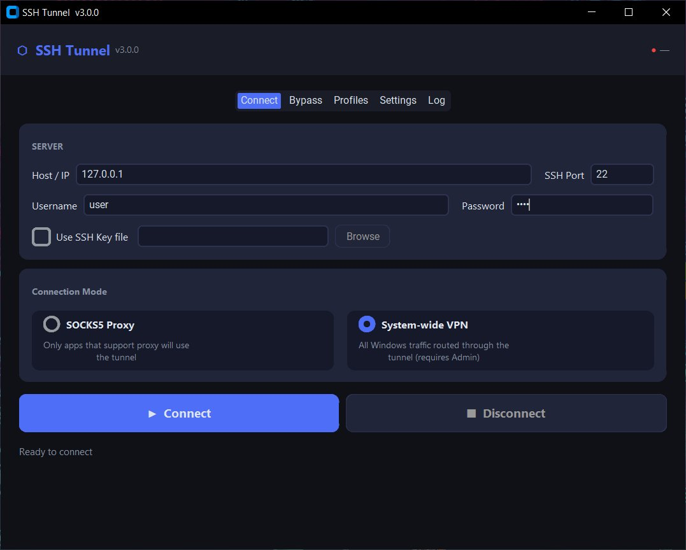
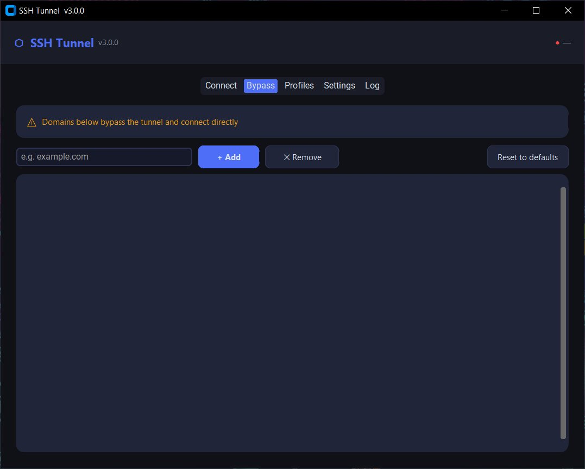

<p align="center">
  
</p>

<p align="center">
  <a href="https://github.com/YOUR_USERNAME/ssh-tunnel/releases"></a>
  <a href="LICENSE"></a>
  <a href="https://www.python.org/downloads/"></a>
  
  
</p>

---

**SSH Tunnel** is a modern Windows desktop application that turns any SSH server into a secure SOCKS5 proxy or system-wide VPN — no third-party server software required.

## Features

- **Dual modes** — SOCKS5 proxy (per-app) or System-wide VPN (all Windows traffic)
- **Built-in HTTP CONNECT proxy** — enables full browser support including DNS-over-tunnel
- **Multi-profile management** — save and switch between multiple SSH server configurations
- **Bypass domains** — route specific domains directly, bypassing the tunnel
- **Auto-reconnect** — detects connection drops and reconnects automatically
- **System tray** — minimize to tray, stays running in background
- **Bilingual UI** — English and Persian (فارسی) interface
- **No server setup** — works with any standard OpenSSH server (`AllowTcpForwarding yes`)
- **Single EXE** — build a portable executable with one command

## Screenshots

<p align="center">
  
  &nbsp;
  
</p>

## Requirements

| Requirement | Version |
|-------------|---------|
| Windows | 10 or later |
| Python | 3.10 or later |
| SSH Server | OpenSSH with `AllowTcpForwarding yes` |

## Quick Start

### Run from source

```bash
# 1. Clone the repository
git clone https://github.com/YOUR_USERNAME/ssh-tunnel.git
cd ssh-tunnel

# 2. Install dependencies
pip install -r requirements.txt

# 3. Run
python ssh_tunnel.py
```

### Build standalone EXE

```bash
# Double-click build.bat  — or run from terminal:
build.bat
# Output: dist\SSH-Tunnel.exe
```

> **Note:** For **System-wide VPN** mode, run the application as Administrator.

## Usage

### Modes

| Mode | Description | Use case |
|------|-------------|----------|
| **SOCKS5 Proxy** | Apps that support proxy settings use the tunnel | Browsers (manual proxy), curl, Telegram |
| **System-wide VPN** | All Windows traffic is routed through the tunnel | Full traffic routing |

### Ports

| Port | Protocol | Purpose |
|------|----------|---------|
| `9000` | SOCKS5 | Direct proxy — configure manually in apps |
| `9001` | HTTP CONNECT | Browser-friendly proxy with remote DNS |

When **System-wide VPN** mode is active, Windows proxy settings are automatically configured to use both ports.

### Bypass Domains

Domains in the bypass list connect **directly** without going through the tunnel. Useful for local services, intranet sites, or domains that should not be proxied.

Format — one per line:
```
example.com
*.internal.corp
192.168.1.0/24
```

### Profiles

Multiple SSH server configurations can be saved as named profiles. Switch between them from the **Profiles** tab without re-entering credentials.

## Server Requirements

Your SSH server needs TCP forwarding enabled. Check `/etc/ssh/sshd_config`:

```
AllowTcpForwarding yes
```

Restart SSH after any changes:
```bash
sudo systemctl restart sshd
```

## Configuration

Settings are stored at `%USERPROFILE%\.ssh_vpn_config.json`. No data is sent anywhere — everything stays local.

Log file: `%USERPROFILE%\.ssh_vpn.log`

## Building from Source

```
ssh-tunnel/
├── ssh_tunnel.py        # Main application
├── requirements.txt     # Python dependencies
├── build.bat            # Build script (creates dist\SSH-Tunnel.exe)
├── assets/
│   ├── logo.svg         # Application logo
│   ├── banner.svg       # README banner
│   └── icon.svg         # Small icon
├── docs/
│   └── ARCHITECTURE.md  # Technical deep-dive
├── .github/
│   ├── workflows/
│   │   └── release.yml  # Auto-build on tag push
│   └── ISSUE_TEMPLATE/
│       ├── bug_report.md
│       └── feature_request.md
└── LICENSE
```

## How It Works

```
Your App
   │
   ▼
[Local SOCKS5 :9000]  ←── or ──  [Local HTTP Proxy :9001]
   │                                        │
   └──────────────┬─────────────────────────┘
                  ▼
         SSH encrypted tunnel
                  │
                  ▼
         Remote SSH Server
                  │
                  ▼
            The Internet
```

1. A local SOCKS5 server (port 9000) and HTTP CONNECT proxy (port 9001) are started
2. Each incoming connection opens a `direct-tcpip` SSH channel to the destination
3. Bytes are relayed bidirectionally through the encrypted SSH transport
4. In System-wide VPN mode, Windows registry proxy settings are updated automatically

## Contributing

Contributions are welcome. Please open an issue first to discuss major changes.

1. Fork the repository
2. Create a feature branch (`git checkout -b feature/my-feature`)
3. Commit your changes (`git commit -m 'Add my feature'`)
4. Push to the branch (`git push origin feature/my-feature`)
5. Open a Pull Request

## License

This project is licensed under the **MIT License** — see [LICENSE](LICENSE) for details.

---

<p align="center">
  
  <br/>
  <sub>Made with ♥ — open source, no telemetry, no accounts required</sub>
</p>
